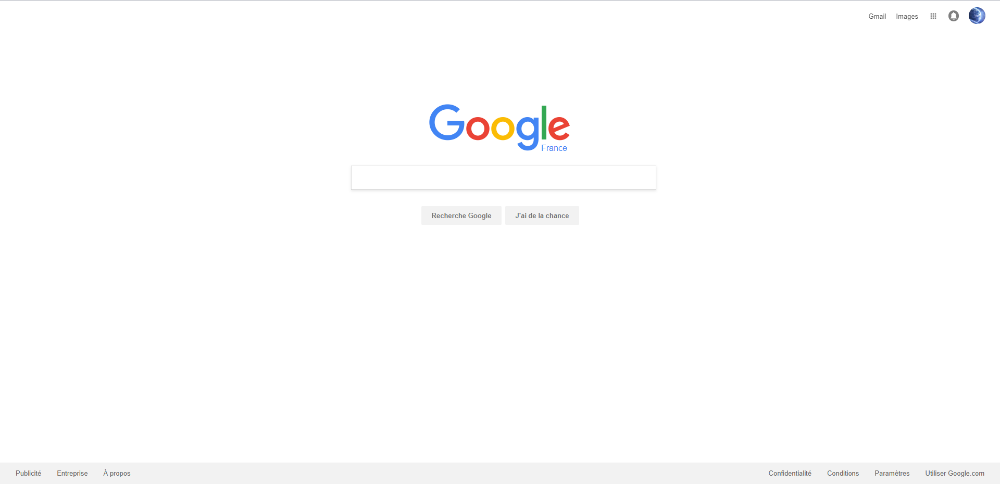
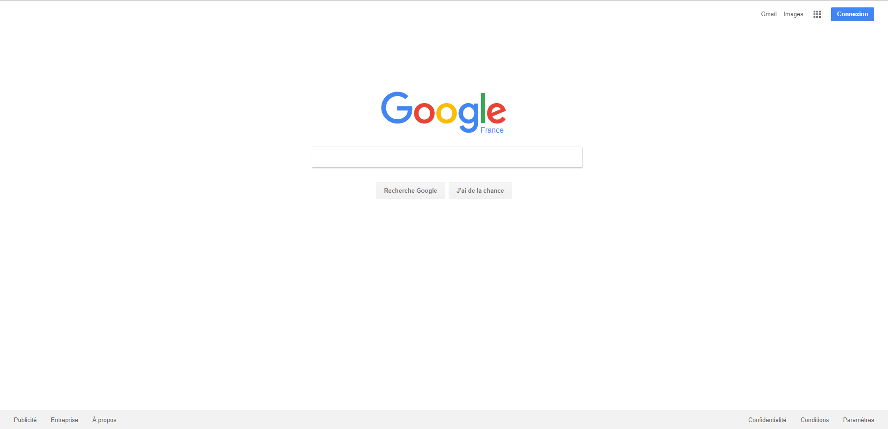

# Google Homepage
Copy of the [2017 Google.fr Home Page](https://web.archive.org/web/20170331123832/https://www.google.fr/?gws_rd=ssl) using vanilla HTML and CSS. This was part of the Odin Project Web Development Curriculum.

Particular attention to detail was given to the positioning of elements to create a pixel-perfect copy. Can you guess which one is mine?
|  |  |
| ----------------------------------------------------------------------- | ------------------------------------------------------------------------------------ |
